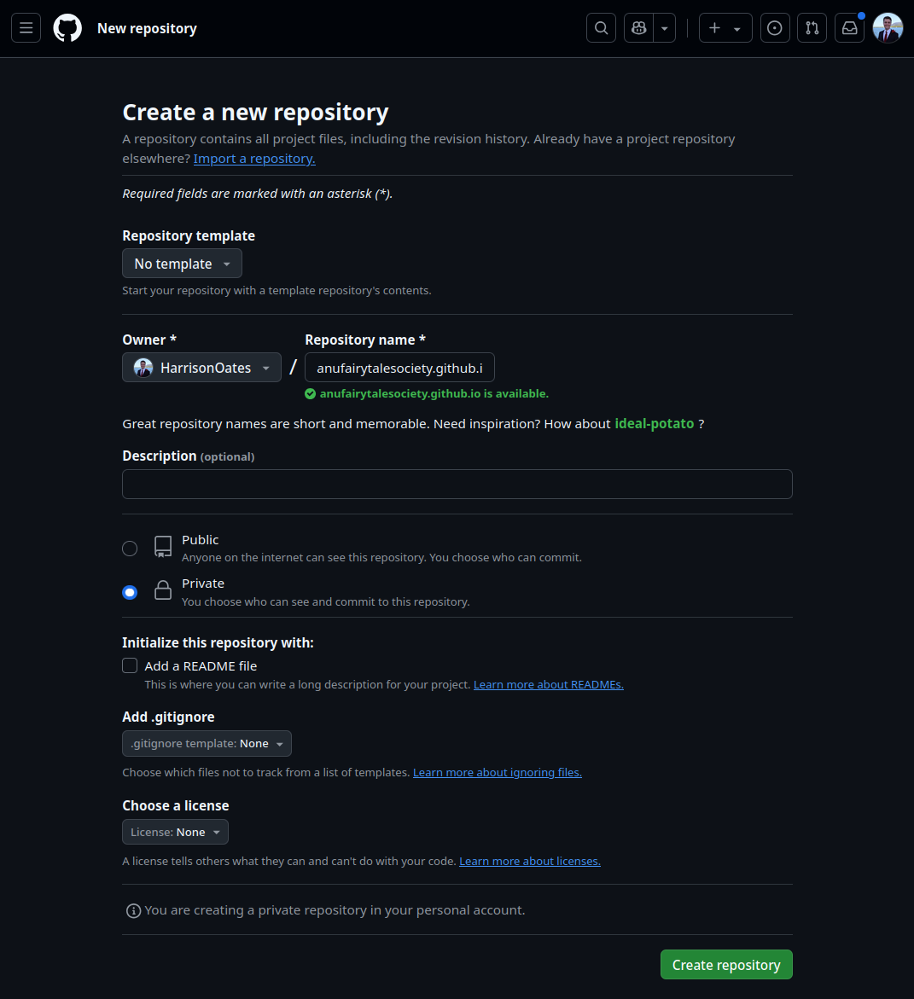

# Building and Hosting Websites for Clubs and Societies

This repository is a guide for ANUSA clubs and societies to build and host their websites. The guide is written in a way that is accessible to beginners, and assumes no prior knowledge of web development. The guide is open source and contributions are welcome. It is intended to be a living document that is updated as new technologies and best practices emerge.

> **Who is this for? (And Don't Worry!)**
> If you've never coded before, you're in the right place. This guide is designed for you. We'll walk you through every step, and you can't break anything permanently. Think of it like following a recipe!

> **💡 Quick Start / TL;DR**
>
> 1.  Create a GitHub account and a repository named `yourclub.github.io`.
> 2.  Find a Jekyll template you like [here](http://jekyllthemes.org/).
> 3.  Click "Use this template" to copy it to your repository.
> 4.  Edit the `_config.yml` file on GitHub to add your club's name and details.
> 5.  Go to `Settings > Pages`, select "Deploy from a branch", and choose the `main` branch.
>
> Your website is now live! Read the full guide below to learn how to customize it.

## A Note on Tools

While you can do almost everything from the GitHub website, a couple of free tools can make your life easier for more complex edits.

*   **Text Editor (VS Code):** Instead of using a basic text app, we highly recommend [Visual Studio Code (VS Code)](https://code.visualstudio.com/). It's like "Word for code"—it helps you with formatting and makes editing website files much clearer.
*   **GitHub Desktop:** The instructions in this guide sometimes mention the "command line" or "terminal." This can be intimidating. [GitHub Desktop](https://desktop.github.com/) is a user-friendly app that lets you manage your website files with buttons and menus instead of commands. We recommend installing it for managing your files on your computer.

---

## Table of Contents
1. [Why a Website?](#why-a-website)
2. [Setting Up a GitHub Repository](#setting-up-a-github-repository)
3. [The Website](#the-website)
    + [Migrating an Existing Website to GitHub](#migrating-an-existing-website-to-github)
    + [Creating a New Website](#creating-a-new-website)
4. [Maintaining and Enhancing Your Website](#maintaining-and-enhancing-your-website)
    + [How to Update Your Website](#day-to-day-how-to-update-your-website)
    + [Using a Custom Domain](#using-a-custom-domain)
5. [Glossary](#glossary)

## Why a Website?
Section 37 of the Clubs Regulations begins with the following:

> Within 2 weeks of holding a general meeting, the club must post the following documentation to [a] publicly available website: [...]

This is an affiliation requirement for ANU student clubs and societies. While website builders are available, they often come with costs for hosting and custom domains. This guide will show you how to build a new website, or migrate an existing website, for free using GitHub Pages. Ongoing costs will be limited to the cost of a custom domain, if desired.

## Setting Up a GitHub Repository

> **What's a Repository?** A repository (or "repo") is just a folder for a project. It contains all your website's files and is stored on GitHub's servers.

First, you will need a GitHub account. If you don't have one, you can sign up at [github.com](https://github.com). This should be done with an email address that is associated with the club or society. Once you have an account, you can create a new repository by clicking the green "New" button in the top left corner of the side menu.


You will be taken to a page where you can name your repository and provide a description. The repository name **must** be in the format `clubname.github.io`, where `clubname` is the name of your club or society. This special format is what tells GitHub to treat this repository as a website.

Set the repository to **private**. This will prevent the repository's code (not the public website itself) from being indexed by search engines. You can change this setting later if you wish.

You should also make sure to initialise the repository with a **README**. This creates a `README.md` file that acts as the front page for your repository.



Once you have filled out the form, click the green "Create repository" button. You will be taken to the repository's homepage.

## The Website
There are two paths you can take: migrate an existing website or create a new one from scratch.

- Go to [Migrating an Existing Website](#migrating-an-existing-website-to-github) if you already have a website you want to move.
- Go to [Creating a New Website](#creating-a-new-website) if you want to build a fresh site.

## Migrating an Existing Website to GitHub

> This process is usually a one-time thing. Once your site is migrated, you'll update it using the methods described in the [maintenance section](#day-to-day-how-to-update-your-website).

### Site-builder specific instructions
- **Weebly:** Go to **Settings (Top menu) > General (Left side menu) > Archive**, enter your email address and click on **"Email Archive"**. You will receive an email with a `.zip` file of your website's static contents. (Source: [Reddit](https://www.reddit.com/r/Weebly/comments/rh9otp/possible_to_export_a_static_weebly_site_to_html/))

### General instructions
If your builder isn't listed, we can use a tool called `wget` to download a copy of your live website.

#### Installing `wget`
- **Windows**: Download the latest x64 executable from [here](https://eternallybored.org/misc/wget/).
- **macOS**: The easiest way is with [Homebrew](https://brew.sh/). Once Homebrew is installed, open Terminal and run: `brew install wget`.
- **Linux**: `wget` is typically installed by default.

#### Downloading the website using `wget`
Open your command line (Terminal or PowerShell) and run the following command, replacing the URL with your old website's URL:

```bash
wget -E -r -k -l 10 -p https://www.club-old-website.com/
```
This command will download the website into a folder named `www.club-old-website.com`.

#### Uploading to GitHub
Navigate to your new `yourclub.github.io` repository on GitHub and click the **"Add file" > "Upload files"** button. Drag and drop all the files from the downloaded folder into the browser window. Add a commit message like "Initial site upload" and click **"Commit changes"**.

## Creating a New Website

If you're starting fresh, a **Static Site Generator (SSG)** is the best tool for the job. An SSG takes simple text files (written in Markdown) and combines them with a design template ("theme") to build a complete, fast, and secure website.

The two most popular SSGs that work brilliantly with GitHub Pages are **Jekyll** and **Hugo**.

| Feature | Jekyll | Hugo |
| :--- | :--- | :--- |
| **Simplicity** | **Easiest to start with.** GitHub Pages has built-in support for Jekyll. | Very simple once set up, but requires a small extra step (a "GitHub Action") to publish. |
| **Speed** | Good for most club sites. | **Extremely fast.** One of the fastest SSGs available. |
| **Recommendation** | **Start here if you're new to this.** It's the simplest path. | A great choice if you want the fastest possible site. |

We recommend starting with Jekyll.

### Option 1: Jekyll (The Beginner-Friendly Choice)

The easiest way to start is with a pre-made template.

#### Step 1: Find and Copy a Jekyll Template
1.  Browse for a theme you like on sites such as [Jekyll Themes](http://jekyllthemes.org/), [Jamstack Themes](https://jamstackthemes.dev/ssg/jekyll/), or [Github's `#jekyll-theme` topic](https://github.com/topics/jekyll-theme).
2.  Once you find a theme, go to its GitHub repository.
3.  Click the green **"Use this template"** button. This will create a new repository in your account, pre-filled with the theme's files.
4.  When prompted, name this new repository `yourclubname.github.io`.

#### Step 2: Configure Your Site
In your new repository, find the file named `_config.yml`. This is your site's main control panel. Click it and use the pencil icon (✏️) to edit.

You'll want to change a few key settings:
*   `title`: The name of your club.
*   `description`: A short sentence about your club.
*   `url`: `https://yourclubname.github.io`
*   `baseurl`: Leave this blank (`""`).

> **💡 Tip:** Every theme has different options in `_config.yml`. Read through the file and update things like social media links or contact email addresses.

#### Step 3: Add Your Content
*   **Pages:** Look for files like `about.md` or `contact.md`. Edit these to add your club's information. Content is written in Markdown, a simple text format. [Here's a quick guide](https://www.markdownguide.org/cheat-sheet/).
*   **Posts/Updates:** Many themes have a `_posts` folder. To add an update (like an event or AGM minutes), create a new file in this folder named `YYYY-MM-DD-your-post-title.md`. Copy the structure from an existing post to get started.

#### Step 4: Enable GitHub Pages
1.  Go to your repository's **Settings** tab.
2.  In the side menu, click on **Pages**.
3.  Under "Build and deployment", set the **Source** to **"Deploy from a branch"**.
4.  Select the `main` branch and the `/(root)` folder. Click **Save**.


That's it! GitHub will now build and host your website. It may take a few minutes to go live at `https://yourclubname.github.io`.

### Option 2: Hugo (The Fast & Modern Choice)

Hugo is famous for its speed but requires a one-time setup of a "GitHub Action" to build your site. This is a more advanced option.

#### Step 1: Install Hugo on Your Computer
Follow the [Official Hugo Installation Guide](https://gohugo.io/installation/). On a Mac, the command is `brew install hugo`.

#### Step 2: Create a Site and Add a Theme
1.  From your command line, run:
    ```bash
    hugo new site your-club-name
    cd your-club-name
    git init
    ```
2.  Find a theme on the [official Hugo Themes site](https://themes.gohugo.io/) and add it as a "git submodule" according to its instructions.
3.  Push your new project folder to the `yourclubname.github.io` repository you created earlier.

#### Step 3: Set up the GitHub Action for Deployment
1.  In your repository on GitHub, click the **Actions** tab.
2.  Search for the workflow named **"Hugo"** and click "Configure".
3.  The default file is usually perfect. Click **"Commit changes..."** to save it. This action tells GitHub how to build your site.

#### Step 4: Enable GitHub Pages for the Action
1.  Go to your repository's **Settings** tab, then **Pages**.
2.  Under "Build and deployment", change the **Source** to **"GitHub Actions"**.

Now, every time you `git push` changes from your computer, the Action will run and update your live website.

---

## Maintaining and Enhancing Your Website

Your site is live! Here’s how to manage it.

### Day-to-Day: How to Update Your Website

There are three main ways to keep your site fresh:

1.  **For simple text changes:** The easiest way! Just navigate to the file on the GitHub website (e.g., `about.md`), click the pencil icon to edit it, and save your changes.
2.  **For uploading files (e.g., AGM Minutes):** Go to the folder in your repository where you want to add the file (like `_posts` or a `documents` folder). Click **"Add file" > "Upload files"** and drag your PDF or Markdown file into the window.
3.  **For major changes (e.g., changing themes):** This is where using **VS Code** and **GitHub Desktop** comes in handy. You can "pull" a copy of the site to your computer, make lots of changes safely, and then "push" them back to GitHub when you're ready.

### Using a Custom Domain

Want your website at `www.yourclub.com` instead of `yourclub.github.io`? You can! However, this likely won't be able to be covered by ANUSA grants, so it will be an out-of-pocket expense for your club.

1.  **Buy a domain:** First, you need to purchase a domain name from a registrar like GoDaddy or Namecheap. This is the only cost involved.
2.  **Configure DNS:** In your domain registrar's control panel, you'll need to point your domain to GitHub's servers. You do this by adding specific `A` records or a `CNAME` record.
3.  **Set it on GitHub:** In your repository's **Settings > Pages > Custom domain**, type in your new domain name and click **Save**.

> For detailed instructions, follow the official [GitHub Docs guide on setting up a custom domain](https://docs.github.com/en/pages/configuring-a-custom-domain-for-your-github-pages-site). It is very clear and has the most up-to-date information.

## Glossary

*   **Branch:** A parallel version of your repository. The main one is usually called `main`. You don't need to worry about this for a simple website.
*   **Command Line:** A text-based interface (like Terminal or PowerShell) for running commands on your computer.
*   **Commit:** A saved change. Every time you save a file or upload something to Github, you make a "commit" with a message describing what you did.
*   **Markdown (.md):** A simple way to write formatted text. You use symbols like `#` for a heading or `*` for a bullet point.
*   **Repository (Repo):** A project's folder, containing all its files and the history of its changes.
*   **Static Site Generator (SSG):** A tool (like Jekyll or Hugo) that builds a website from simple text files and a template.

## Getting Help and Contributing
This guide is a living document created by and for students. If you find a typo, think a section could be clearer, or have an idea for an improvement, please contribute! You can do so through [raising an issue or pull request on our repo!](https://github.com/anusaclubs/anusaclubs.github.io/pulls).
If you're stuck or not sure what to do, the [ANU Computer Science Students Association discord server](cssa.club/discord) can be super helpful to get help from.